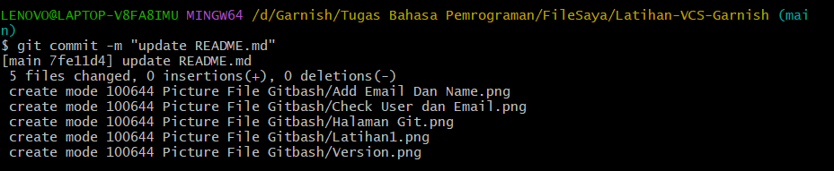
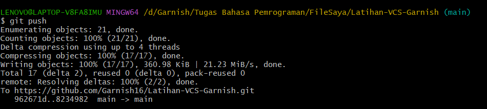
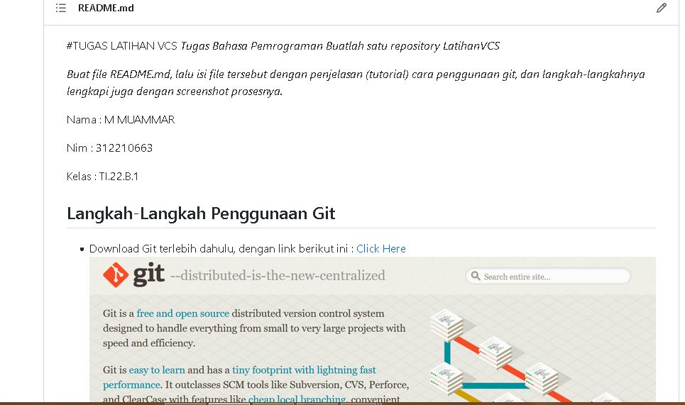

*Tugas Bahasa Pemrograman*
*Buatlah satu repository LatihanVCS*
*Buat file README.md, lalu isi file tersebut dengan penjelasan (tutorial) cara penggunaan git, dan langkah-langkahnya lengkapi juga dengan screenshot prosesnya.*

Nama      : M MUAMMAR

Nim        : 312210663

Kelas      : TI.22.B.1

## Langkah-Langkah Penggunaan Git

* Download Git terlebih dahulu, dengan link berikut ini : [Click Here](https://git-scm.com/)

* Setelah file terdownload, silahkan lakukan instalasi dengan referensi berikut ini : [Git Installation Guide](https://git-scm.com/book/en/v2/Getting-Started-Installing-Git)

* Setelah proses installasi selesai, silahkan buka *software* **GitBash** pada menu di Windows, dan lakukan pengecekan versi, dengan mengetik syntax berikut :
    > git --version

    

    * Jika muncul tampilan git version, berarti Git sudah berhasil di install dan bisa digunakan. Langkah pertama kita harus mengkonfigurasi user nama dan email di Git, dengan mengetikkan *syntax* berikut :
> git config --global user.name "Masukkan Nama Anda disini"
> git config --global user.email "Masukkan Email Anda disini"

Setelah diisi, silahkan lakukan pengecekan user nama dan email, dengan mengetikkan perintah berikut :
> git config --global user.name
> git config --global user.email

* Silahkan Buat akun di [GitHub](https://github.com) , seperti contoh dibawah ini. Dan lakukan *verifikasi* akun melalui email yang sudah terdaftar.
 

* Jika akun GitHub sudah selesai dibuat dan diverifikasi, Proses selanjutnya silahkan buat *Repository* seperti gamabr dibawah ini.
**Noted** : 
> * Repository Name : (Silahkan isi nama repository yang diinginkan, seperti contoh saya ingin membuat repository *Tugas-VCS*)
> * Description : (Isi dengan deskripsi atau penjelasan tentang repository Anda)
> * Public / Private : (PIlih salah satu jenis repository akan bisa dilihan sama semua orang atau tidak)
> * Add a README.md file : Centang pada bagian ini jika Anda menginginkan file README.md ada di repository Anda
> * Add .gitignore : Merupakan  sebuah file yang berisi daftar nama-nama file dan direktori yang akan diabaikan oleh Git.
> * Choose a license : Silahkan centang jika Anda memiliki lisensi pada repository yang akan dibuat
Kemudian tekan tombol **Create Repository** untuk menyimpan

* Jika repository sudah dibuat maka akan muncul tampilan seperti dibawah ini :

* Proses pembuatan akun dan repository pada Github telah selesai, saat ini akan kita lakukan untuk *me-remote* repository Github pada GitBash Lokal. Bagaimana caranya?
Langkah pertama kita harus menyalin *link URL* git kita di Github, dengan cara tekan tombol **Code** lalu klik *Copy*.

* Setelah *Link URL* git kita ter*copy*, Silahkan buka File Explorer pada Windows, kemudian pilih folder dimana kita akan men*download* Repository dari Github ke lokal. Kemudian Klik Kanan, Pilih ***Git Bash Here***.

* *Pop Up* Command Prompt (CMD) akan terbuka. Pada proses ini kita akan melakukan download file repository yang tadi dibuat, dengan mengetikkan *syntax* berikut :
> git clone [URL]
Pada contohnya, saya akan memasukkan *https://github.com/muammarM/Tugas-VCS.git*

* Setelah proses cloning selesai, pada saat ini kita masih pada folder awal (master), kita harus masuk kedalam folder yang telah dicloning tadi yaitu *Tugas-VCS* dengan mengetikkan *syntax* berikut :
> cd Tugas-VCS

* Saat ini kita sudah masuk kedalam folder *LatihanVCS*, Silahkan edit file **README.md** yang ada di File Explorer. Bisa menggunakan Text Editor (*Sublime Text, Notepad, Notepad++, Visual Studio Code*). Edit sesuai dengan keinginan. Aturan file .md (Markdown) bisa dilihat di Link berikut ini : [Click Here](https://guides.github.com/features/mastering-markdown/)

Setelah file README.md diedit, silahkan Simpan file tersebut dengan cara **CTRL+S** atau **File -> Save**

* Langkah selanjutnya setelah file disimpan, kita kembali pada App Git Bash (CMD). Ketik pada Git Bash seperti berikut ini :
> git add .

* Setelah selesai melakukan *git add .* langkah berikutnya kita akan melakukan **commit*. Fungsi commit adalah untuk menyimpan perubahan yang dilakukan, tetapi tidak ada perubahan pada remote repository. Ketik pada App Git Bash seperti berikut ini :
> git commit "Update README.md"

* Git *commit* telah selesai di lakukan. Untuk saat ini akan melakuka Git Push, *Git Push* berfungsi untuk mengirimkan perubahan file setelah di commit ke remote repository. Silahkan ketik pada App Git Bash seperti berikut :
> git push

* Semua proses telah selesai, silahkan kembali ke Web Browser untuk melihat perubahan yang telah di *commit* dan *push* dari remote. 

Berikut adalah langkah-langkah penggunaan GIT HUB

Sekian informasi yang dapat saya sampaikan

#ATAS PERTHATIANNYA, TERIMAKASIH.
=======
>>>>>>> M MUAMMAR
